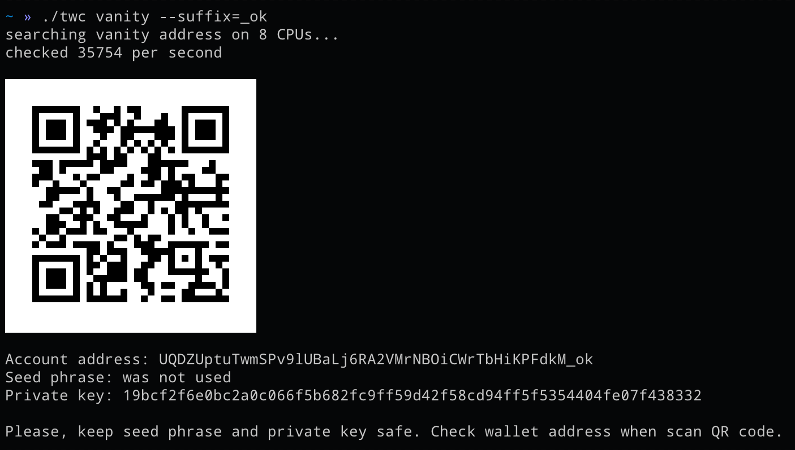

# TON Wallet CLI
[![Based on TON][ton-svg]][ton]

Simple command-line TON wallet based on <a href="https://github.com/xssnick/tonutils-go" target="_blank">tonutils-go</a>.



------
If you like this application and want to support its development you can donate any amount of coins to this ton address: `UQCSupclYOFA77n7HtSKt_hsa08inwTY7Gg8Ytz2GjHW_TWC`

[Join Telegram chat](https://t.me/ton_wallet_cli) and ask any question.


## How to install
1. Download precompiled version:
   * [Linux AMD64](https://github.com/moorzeen/ton-wallet-cli/releases/download/v0.1.1/twc-linux-amd64)
   * [Linux ARM64](https://github.com/moorzeen/ton-wallet-cli/releases/download/v0.1.1/twc-linux-arm64)
   * [Windows x64](https://github.com/moorzeen/ton-wallet-cli/releases/download/v0.1.1/twc-x64.exe)
   * [Mac Intel](https://github.com/moorzeen/ton-wallet-cli/releases/download/v0.1.1/twc-mac-amd64)
   * [Mac Apple Silicon](https://github.com/moorzeen/ton-wallet-cli/releases/download/v0.1.1/twc-mac-arm64)

2. In case of Linux go to file directory and make it executable:
   ```bash
   chmod +x twc-linux-amd64
   ```
   or if you're on Mac then run:
    ```bash
   chmod +x twc-mac-arm64 && xattr -r -d com.apple.quarantine twc-mac-arm64
   ```
    In case of Windows skip this step.

3. Run `twc` with command `version` to check installation:
   ```bash
   ./twc-mac-arm64 version
   ```
   In case of success you will see actual version of application.

## How to use
### Create regular wallet
```bash
./twc-mac-arm64 new
```

### Create vanity wallet
```bash
./twc-mac-arm64 vanity --suffix=cold
```
This command creates a wallet account using only a private key. If you need a seed phrase, please add the `--seed` argument. However, note that searching with seed might take longer.


### Get balance
```bash
./twc-mac-arm64 balance --address=UQCSupclYOFA77n7HtSKt_hsa08inwTY7Gg8Ytz2GjHW_TWC
```

### Send TON
```bash
./twc-mac-arm64 send --to=UQCSupclYOFA77n7HtSKt_hsa08inwTY7Gg8Ytz2GjHW_TWC --amount=ALL --key="[your wallet seed phrase or private key]"
```

### Get app version
```bash
./twc-mac-arm64 version
```

### Help
```bash
./twc-mac-arm64 help
```

## Testnet
To run in testnet add `--testnet` as the last flag in the command line. Example:
```bash
./twc-mac-arm64 balance --address=UQDYzZmfsrGzhObKJUw4gzdeIxEai3jAFbiGKGwxvxHinf4K --testnet
```

## Contributing
Contributions are welcome! If you have any suggestions, feature requests or find any issues, please open an issue or submit a pull request.

<!-- Badges -->
[ton-svg]: https://img.shields.io/badge/Based%20on-TON-blue
[ton]: https://ton.org